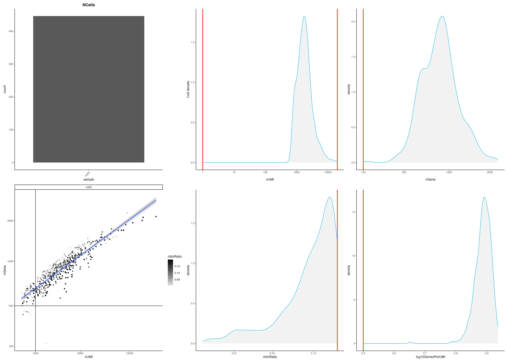
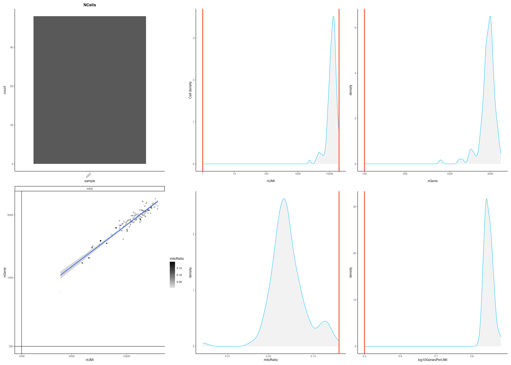
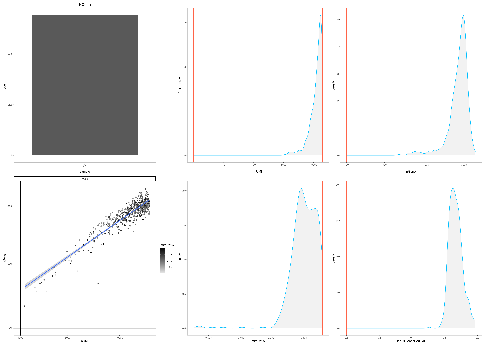
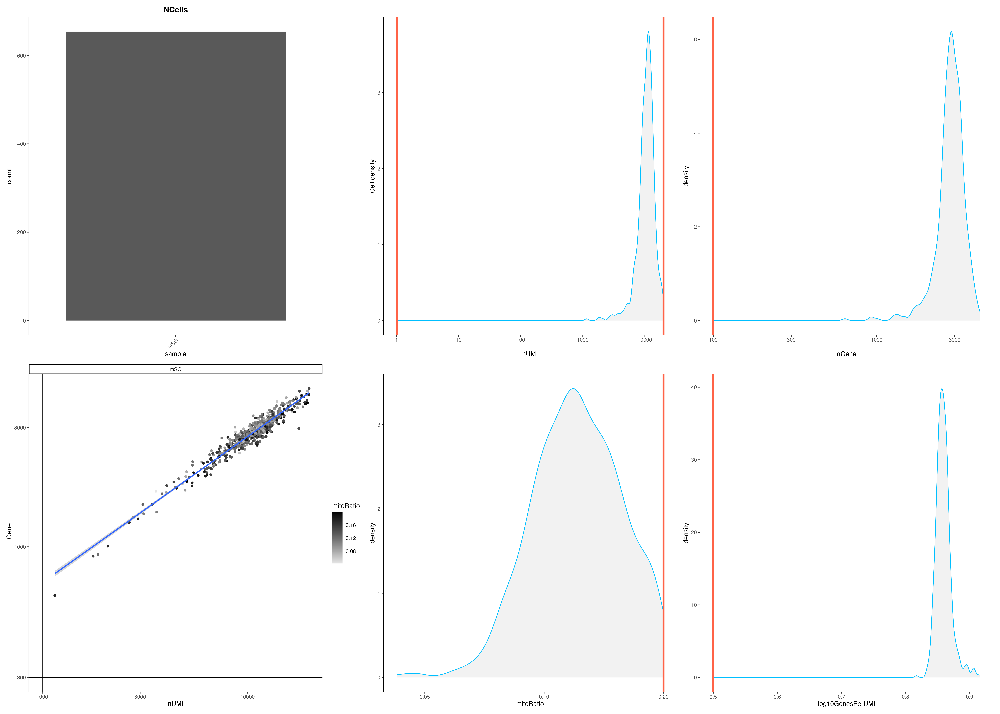
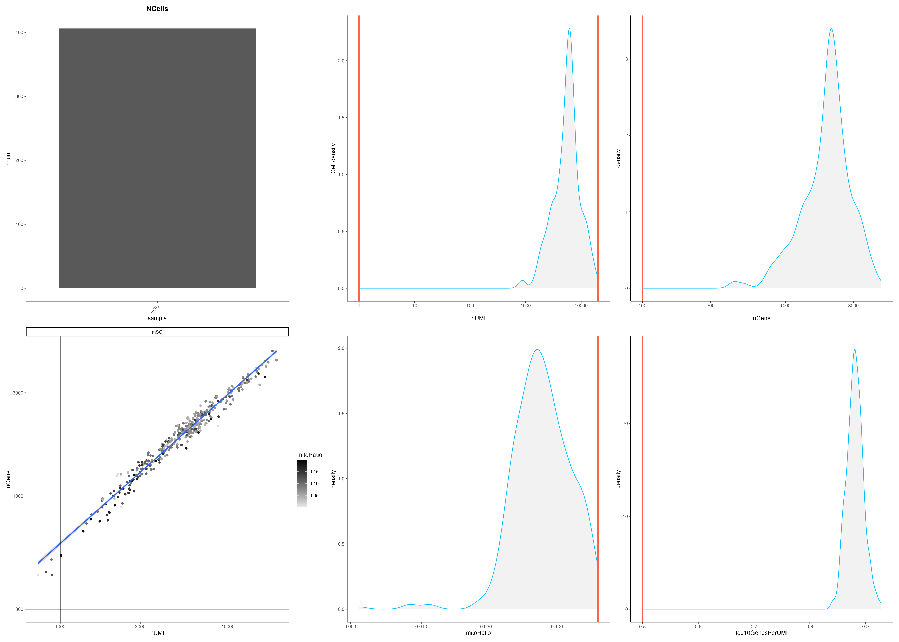
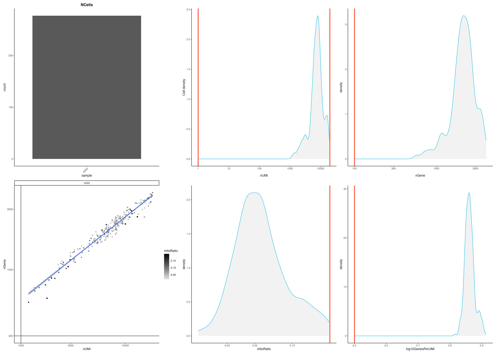

# scRNA_seq_Analysis

resolution 0.5, upper bound of nUMI = 20000
Quality Control->PCA->UMAP->Clustering->Pseudotime Analysis 

## Perform QC for each cluster:

**Cluster ?** 

**Cluster Basal** 

**Cluster Acinar1** 

**Cluster Acinar2** 

**Cluster Ductal1** 

**Cluster Ductal2** 

**Cluster Ductal3_1** 

**Cluster Ductal3_2** 

**Cluster Endothelial** 

