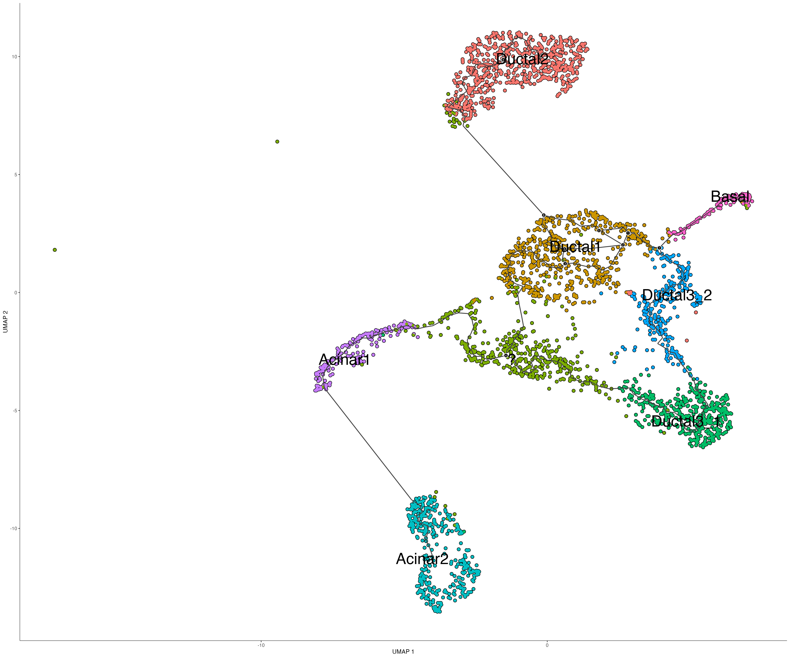
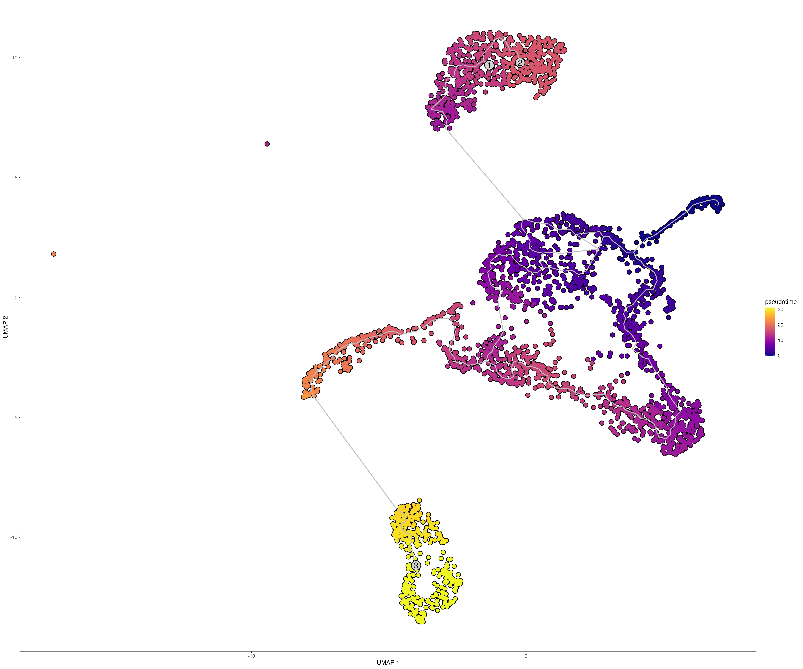

# scRNA_seq_Analysis

resolution 0.5, upper bound of nUMI = 20000
Quality Control->PCA->UMAP->Clustering->Pseudotime Analysis 

## Quality Plots for Each Cluster:

**Cluster ?** \
For Cluster ?, log10GenesPerUMI is in the normal range, 0.8+, so are other filter conditions, which are all in the normal range. 

**Cluster Basal** \

**Cluster Acinar1** \
As we discussed before, the log10GenesPerUMI for cluster Acinar1 is less than 0.8 (the threshold for other clusters) , and there two peaks shown in plot.  

**Cluster Acinar2** \

**Cluster Ductal1** \

**Cluster Ductal2** \

**Cluster Ductal3_1** \

**Cluster Ductal3_2** \

**Cluster Endothelial** \

## Pseudotime after filtering out Endothelia cells 

  
   

