# scRNA_seq_Analysis

resolution 0.5, upper bound of nUMI = 20000
Quality Control->PCA->UMAP->Clustering->Pseudotime Analysis 

## Quality Plots for Each Cluster:

**Cluster ?** \
For Cluster ?, log10GenesPerUMI is in the normal range, 0.8+, so are other filter conditions, which are all in the normal range. 

**Cluster Basal** \

**Cluster Acinar1** \
As we discussed before, the log10GenesPerUMI for cluster Acinar1 is less than 0.8 (the threshold for other clusters) , and there two peaks shown in plot.  
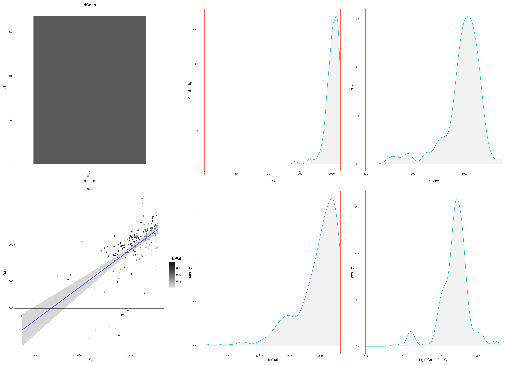

**Cluster Acinar2** \
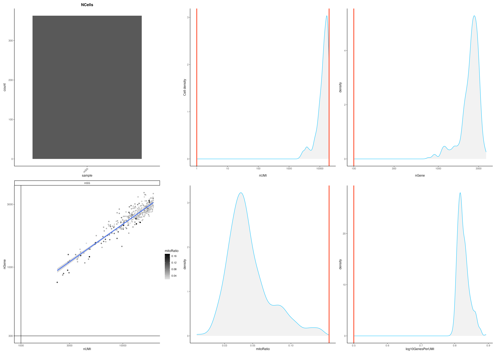

**Cluster Ductal1** \

**Cluster Ductal2** \

**Cluster Ductal3_1** \

**Cluster Ductal3_2** \

**Cluster Endothelial** \
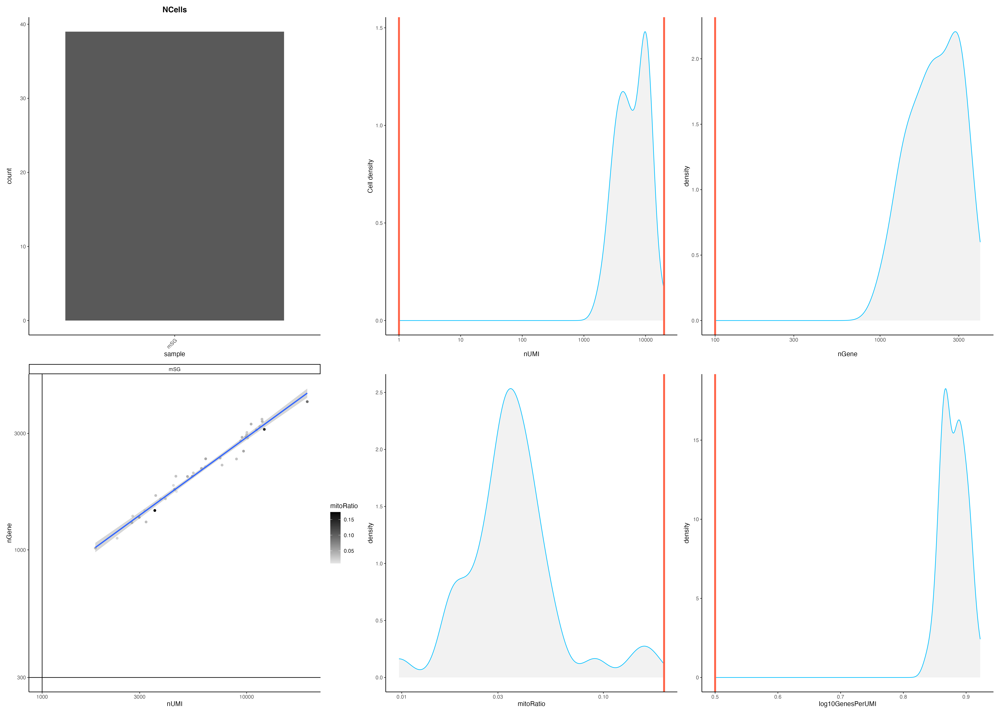

## Pseudotime after filtering out Endothelial cells 

  
   

## Rerun-PCA,UMAP and Pseudotime after filtering out Endothelial cells

**Comparison of UMAP after filtering out Endothelial cells** 

  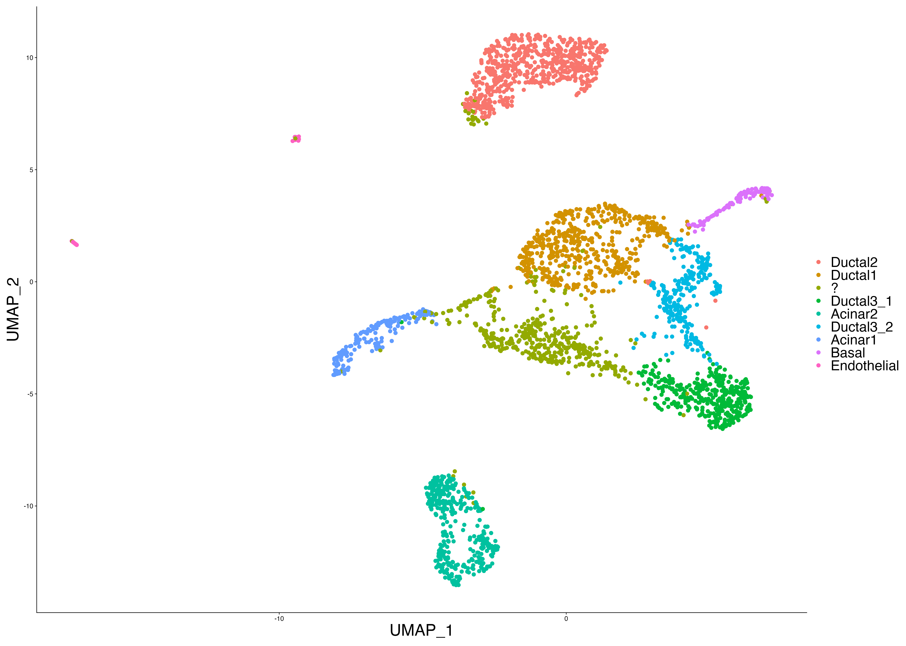
  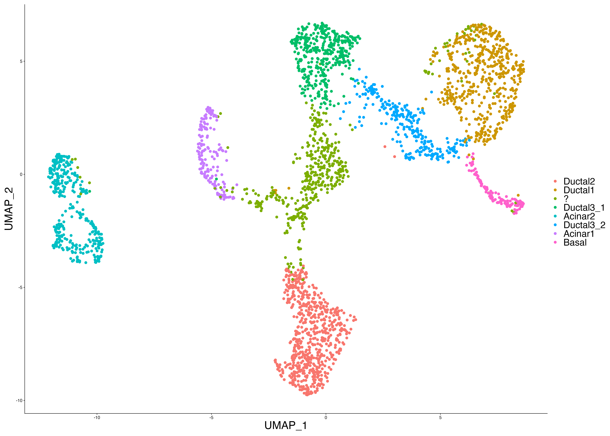 

**Pseudotime Analysis after reclustering**

  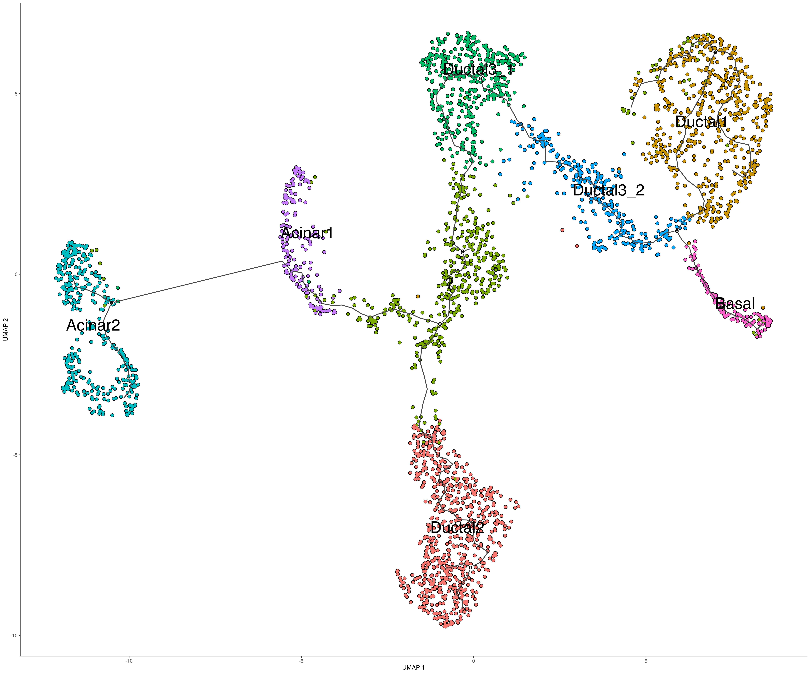
  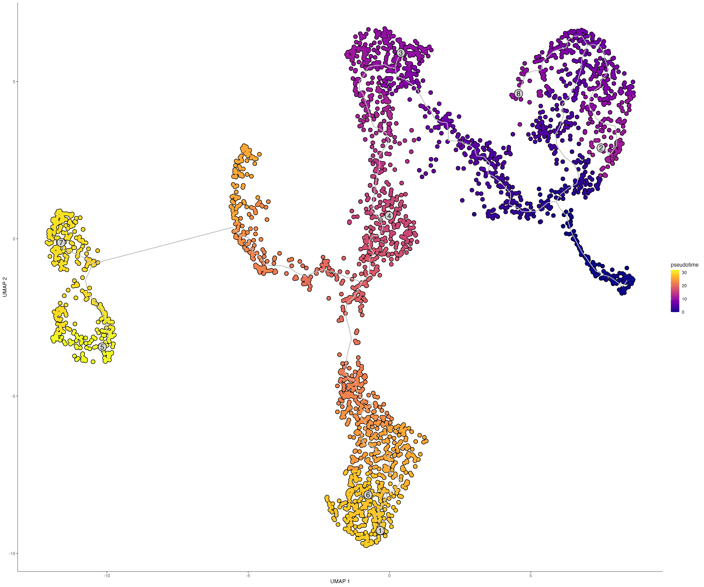 

## cytoTrace Results

**Basal**\
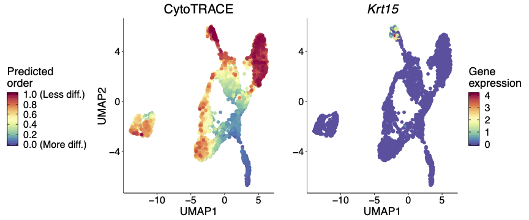

**Ductal2**\
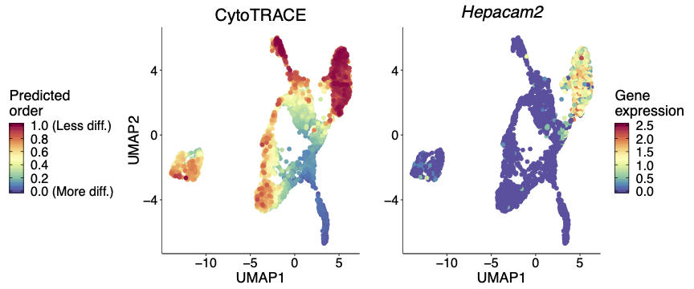

**Ductal3**\
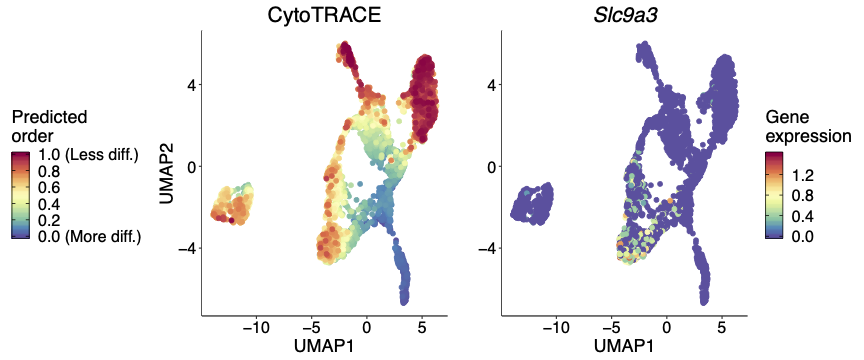

**Ductal1**\
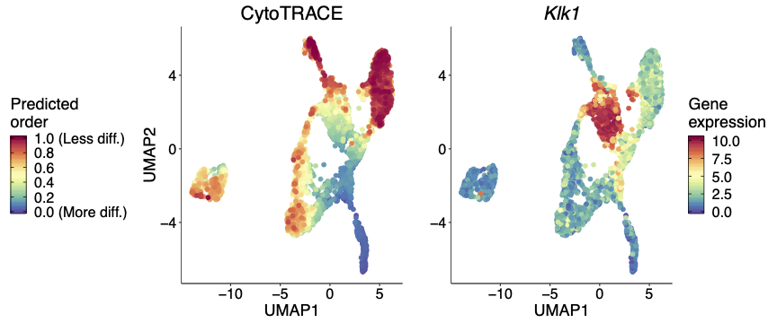

**Acinar1**\
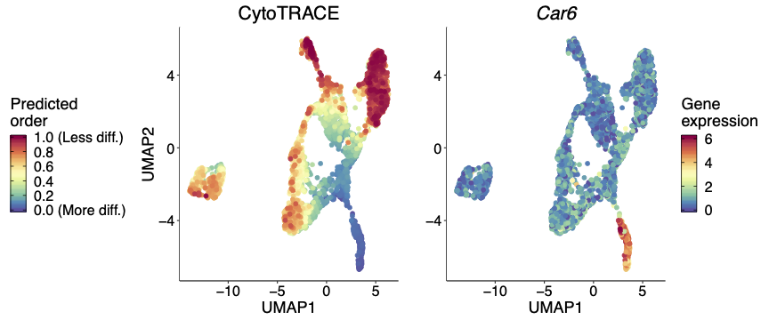

**Acinar2**\
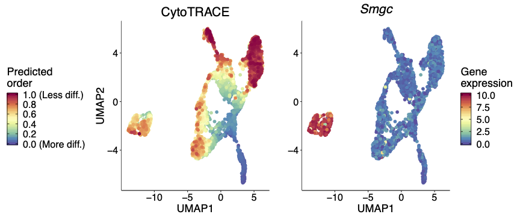

